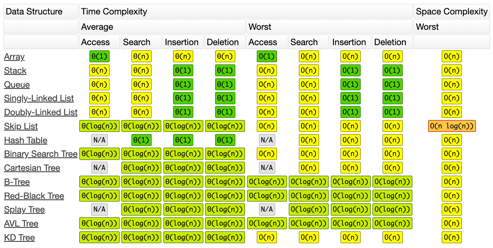

# Algorithms and Data Structures
Mini-talk series

---

# About this series

We're going to discuss

* Concepts
<!--
  * Time & space complexity
  * Memory (stack vs. heap)
  * Recursion
  * Dynamic programming
  * Divide and conquer
-->
* Data structures
<!--
  * Linked lists
  * 1. Arrays and vectors -- Kasper
  * Stacks and queues
  * Heaps (min/max)
  * Hash sets
  * Hash tables
  * Trees and graphs
-->
* Algorithms
<!--
  * Breadth-first search
  * Depth-first search
  * Binary search
-->
* Algorithmic thinking
<!--
How to approach the solution to a coding problem?
How to choose the right algorithm and data structure?
How to optimize an algorithm?
-->

---

## Concepts

* **Time & space complexity**
* Memory (stack vs. heap)
* Recursion
* Dynamic programming
* Divide and conquer

---

## Data structures
* Linked lists
* Arrays and vectors
* Stacks and queues
* Heaps (min/max)
* Hash sets
* Hash tables
* Trees and graphs

---

## Algorithms
* Breadth-first search
* Depth-first search
* Binary search

---

## Algorithmic thinking
* How to approach the solution to a coding problem?
* How to choose the right algorithm and data structure?
* How to optimize an algorithm?

---

# Time and space complexity

---

## Time complexity of algorithms

* We don't want the specify the time of an algorithms in seconds because that is machine _dependent_
* Instead: As a measure of how the running time relates to the input size.
* A rough approximation of the number of operations performed by the algorithm.
* "On the order of..."
* The lower the better.
* Represented by the "Big O"-notation.

---

## Big O notation
* Complexity bounds
  * Big O: Upper bound
  * Big omega, Ω: Lower bound
  * Big theta, Θ: Tight bound
  * In pratice, O() is in place of Θ
* Best case, worst case, expected case

---

## Properties of Big O notation
* Constants are ignored
* Only the most important factors are considered
* Add or multiple complexities: O(A + B) vs. O(A • B)
* Amortized time: Averaged asymptotic time
* Common runtimes: O(1), O(log<sub>2</sub> n), O(n), O(n • log<sub>2</sub> n), O(n<sup>2</sup>), O(n<sup>3</sup>), O(n<sup>4</sup>), ...
* Space complexity

---


---

## Example

```cpp
// increment each value in `vec` by `value`
vector<int> increment(const vector<int>& vec, int value) {
  vector<int> result;            // O(1) time, O(1) space
  for (const auto& v : vec) {    // n times:
    result.push_back(v + value); //   O(1) time, O(1) space
  }
  return result;
}

vector<int> vec = {1, 2, 3, 4, 5};
vector<int> result = increment(vec, 42); // O(n) time and O(n) space
```

---

## Case study

Count unique integers in an unsorted vector, i.e. 

`int count_unique(const vector<int>& vec)`

e.g.

`count_unique([3, 2, 3, 4, 3])` → `3` (unique: 3, 2, 4)

---

## Naïve solution

```cpp
int count_unique(const vector<int>& vec) {
  vector<int> unique_vec;
  for (const auto& v1 : vec) {           // a) O(?)
    bool found = false;
    for (const auto& v2 : unique_vec) {  // b) O(?)
      if (v1 == v2) {
        found = true;
        break;
      }
    }
    if (!found) {
      unique_vec.push_back(v1);          // c) O(?)
    }
  }      
  return unique_vec.size();              // d) O(?)
}

vector<int> vec = {3, 2, 3, 4, 3};
int result = count_unique(vec);          // e) O(?)
```

---


## Naïve solution
```cpp
int count_unique(const vector<int>& vec) {
  vector<int> unique_vec;
  for (const auto& v1 : vec) {           // a) O(n)
    bool found = false;
    for (const auto& v2 : unique_vec) {  // b) O(n) *
      if (v1 == v2) {
        found = true;
        break;
      }
    }
    if (!found) {
      unique_vec.push_back(v1);          // c) O(1) **
    }
  }      
  return unique_vec.size();              // d) O(1)
}

vector<int> vec = {3, 2, 3, 4, 3};
int result = count_unique(vec);          // e) O(n * (n + 1) + 1) = O(n^2)
```

---

## The naïve solution runs O(n<sup>2</sup>) time and uses O(n) space.

Ideas for a better solution?

---

## Using a sorted vector
```cpp
int count_unique(const vector<int>& vec) {
  if (vec.empty()) return 0;
  vector<int> sorted_vec = vec;                    // O(n)
  sort(sorted_vec.begin(), sorted_vec.end());      // O(n * log(n))
  int unique_count = 1;
  for (size_t i = 1; i < sorted_vec.size(); i++) { // O(n)
    if (sorted_vec[i] != sorted_vec[i - 1]) {      // O(1 + 1)
      unique_count++;
    }
  }      
  return unique_count;
}

vector<int> vec = {3, 2, 3, 4, 3};
int result = count_unique(vec); // O(n + n * log(n) + n * 2) = O(n * log(n))
```

---

## Using `std::set` (ordered set)
```cpp
int count_unique(const vector<int>& vec) {
  std::set<int> unique_set;
  for (const auto& v : vec) { // O(n)
    unique_set.insert(v);     // O(log(n))
  }      
  return unique_set.size();   // O(1)
}

vector<int> vec = {3, 2, 3, 4, 3};
int result = count_unique(vec); // O(n * log(n))
```

---

## Using `std::unordered_set`
```cpp
int count_unique(const vector<int>& vec) {
  std::unordered_set<int> unique_set;
  for (const auto& v : vec) { // O(n)
    unique_set.insert(v);     // O(1) (amortized)
  } 
  return unique_set.size();   // O(1)
}

vector<int> vec = {3, 2, 3, 4, 3};
int result = count_unique(vec); // O(n * 1 + 1) = O(n)
```

---

## Space using `std::unordered_set`
```cpp
int count_unique(const vector<int>& vec) {
  std::unordered_set<int> unique_set;
  for (const auto& v : vec) { // O(n)
    unique_set.insert(v);     // O(1) space (amortized)
  }      
  return unique_set.size();
}

vector<int> vec = {3, 2, 3, 4, 3};
int result = count_unique(vec); // O(n) space
```

---

## What is the time and space complexity of this recursive solution?
... but first, how does it work?
```cpp
int count_unique(const vector<int>& vec) {
  count_unique(vec, 0, vec.size());
}

int count_unique(const vector<int>& arr, int index, int size) {
  if (index >= size) return 0;
  bool has_seen_value = is_in_subarray(arr, index - 1, arr[index]);
  return (has_seen_value ? 0 : 1) + count_unique(arr, index + 1, size);
}

bool is_in_subarray(const vector<int>& arr, int size, int elem) {
  if (size < 0) return false;
  return arr[size] == elem || is_in_subarray(arr, size - 1, elem);
}
```

---

Example call stack for `count_unique({5, 6, 7, 6});`
```cpp
// int count_unique(_, int index, int size)
count_unique(0, 4)
    // bool is_in_subarray(_, int size, int elem)
    is_in_subarray(-1, 5)

    count_unique(1, 4)
        is_in_subarray(0, 6)
            is_in_subarray(-1, 6)

        count_unique(2, 4)
            is_in_subarray(1, 7)
                is_in_subarray(0, 7)
                    is_in_subarray(-1, 7)

            count_unique(3, 4)
                is_in_subarray(2, 6)
                    is_in_subarray(1, 6)
                        is_in_subarray(0, 6)
                            is_in_subarray(-1, 6)
      
                count_unique(4, 4)
                  ...
```

---

## What is the time and space complexity here?
```cpp
Time:
count_unique:     O(n) calls
  is_in_subarray: O(n) calls
               => O(n * n) calls
                = O(n^2) time

Space:
count_unique:     O(n) stack frame allocations
  is_in_subarray: O(n) stack frame allocations
               => O(n * n) stack frame allocations
                = O(n^2) space
```
Recursive algorithms are _often_ O(n<sup>B</sup>) time and O(n) space, where `B` is the number of recursive calls in each step.

---



---

# Memory
<!-- good images: https://www.educative.io/edpresso/what-are-the-most-important-data-structures -->