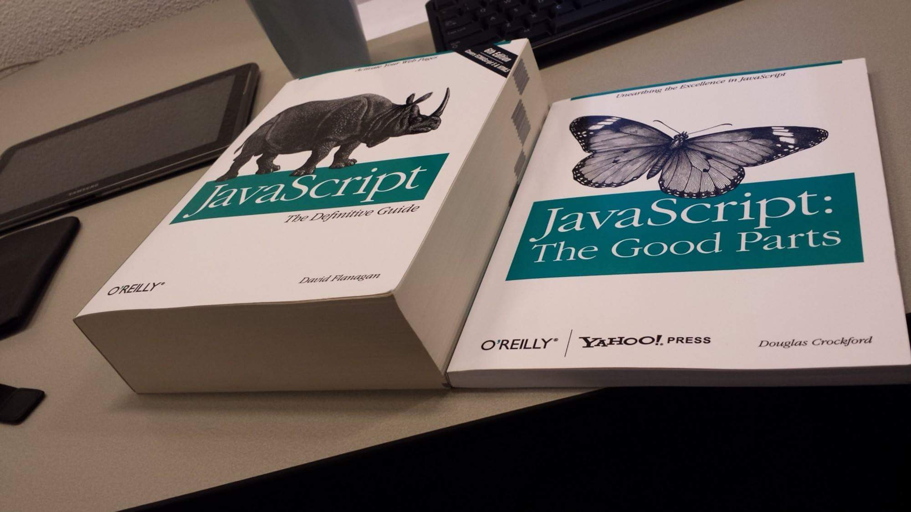
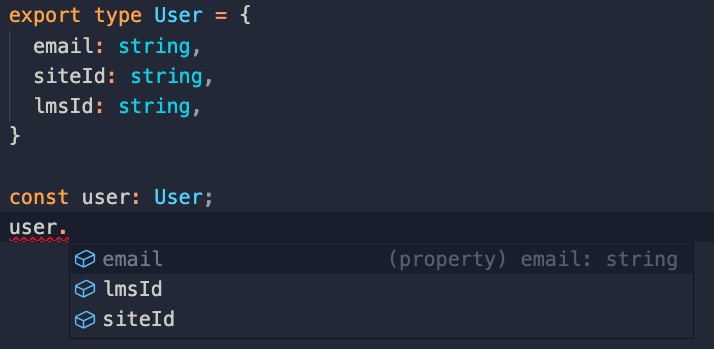

<style>
section p {
  font-size: 1.2em;
}
section pre {
  font-size: 1.4em;
}
.vertical-center {
  margin: 0;
  position: absolute;
  top: 50%;
  -ms-transform: translateY(-50%);
  transform: translateY(-50%);
}

.video-container {
    position: relative;
    padding-bottom: 56.25%;
    padding-top: 35px;
    height: 0;
    overflow: hidden;
}
.video-container iframe {
    position: absolute;
    top:0;
    left: 0;
    width: 100%;
    height: 100%;
}
</style>

# JavaScript, TypeScript, Node.js and React
A quick introduction to the JavaScript ecosystem


---

# About this talk

I'm going to discuss
* The **JavaScript** programming language
* The **TypeScript** programming language
* **Node.js** & the Node Package Manager, **NPM**
* The **React** UI library
---

Let's start with...

--- 

# <!--fit--> JavaScript

---

# What is JavaScript?

JavaScript is a interpreted programming language originally used in web browsers.

Now used everywhere.

---

# What is JavaScript, really?

> JavaScript is a `programming language` that conforms to the ECMAScript specification. JavaScript is `high-level`, often `just-in-time compiled`, and `multi-paradigm`. It has `curly-bracket syntax`, `dynamic typing`, `prototype-based object-orientation`, and `first-class functions`.

---

# JavaScript is _really_ popular

Consistently the most used language on GitHub.

---


---

# JavaScript: The good stuff
* Easy to use (familiar syntax, syntax and error tolerant)
* Simple (dynamic) type system
* Can run everywhere
* Runs instantly (interpretered) and _fast_ (thanks to Chrome V8)
* Native async support is a good fit for web/servers
* Great tooling and ecosystem
* Greatly improved with later versions (ESx/ECMAScript 20xx)
<i><small style="color: gray">ECMA: European Computer Manufacturers Association</small></i>
---

# An interpreted programming language

The code is parsed, compiled and executed at _runtime_.

---

# Dynamically typed

```js
var s = 'hello world';
console.log(s);
// prints 'hello world'

s = 42;
console.log(s);
// prints 42
```

---

# Prototype-based

```js
var a = new Object();
a.__proto__.text = 'Hello!'
console.log(a.text);
// prints 'Hello!'

var b = Object.create(a);
console.log(b.text);
//prints 'Hello!'

// continues...
```

---

# Prototype-based

```js
// ... continued

b.text = 'Hey!';
console.log(b.text);
// prints 'Hey!'

delete b.text;

console.log(b.text);
// prints 'Hello!'
```

---

# Functional aspects

First-class functions

```js
function add(x, y)        { return x + y;      }
function sub(x, y)        { return x - y;      }
function calc(x, y, func) { return func(x, y); }
calc(3, 4, add); // 7
calc(3, 4, sub); // -1
```

---

# Functional aspects

Short lambdas

```js
const add  = (x, y)       => x + y;
const sub  = (x, y)       => x - y;
const calc = (x, y, func) => func(x, y);
calc(3, 4, add); // 7
calc(3, 4, sub); // -1
```

---

# Functional aspects

Array operations: Map, filter etc.

```js
const isEven = (v) => v % 2 === 0;

const arr = [8, 9, 3, 4, 7, 6, 5];
arr.sort()         // [    3,    4,     5,    6,     7,    8,     9]
arr.map(isEven);    // [false, true, false, true, false, true, false]
arr.filter(isEven); // [          4,           6,           8]
```

---

# A bit of history...

JavaScript was created in September 1995.

It was designed and implemented by Brandan Eich, a programmer from Netscape.

---

# <!--fit-->... in _10 days_!

---


---

# <!--fit--> However...

---

# JavaScript has some issues


(Including a lot of "good parts")

---



---

# Interpreted programming language

Fails at runtime.

```js
const say_hello = () => console.log('hello!');

sayHello();
// Uncaught ReferenceError: sayHello is not defined
```

---

# Dynamically typed

```js
const triple = (num) => num * 3;

console.log(triple(42));
// prints 126

console.log(triple('the answer to everything'));
// prints 'NaN'
```

---

# Solutions to typos and type errors

Use TypeScript.

_We'll come back to this later._

---

# Hoisting of declarations

```js
console.log(num);
// Uncaught ReferenceError: num is not defined
```

```js
console.log(num);
// prints 'undefined'

var num;  // Declaration.
num = 42; // Initialization.
```

---

# Hoisting of declarations

```js
console.log(first_name);
// Uncaught ReferenceError: first_name is not defined
```

```js
var first_name = 'James';
console.log(first_name + ' ' + last_name);
// prints 'James undefined'

var last_name = 'Bond';
console.log(first_name + ' ' + last_name);
// prints 'James Bond'
```

---

# Scoping

```js
{
  var x = 4;
}
console.log(x); // 4
```

---

# Solution to hositing and scoping

Use `let` or `const` instead of `var`.

Available from ES6 (ECMAScript 2015).

---

# Solution to hositing

```js
const first_name = 'James';
console.log(`${first_name} ${last_name}`);
// Uncaught ReferenceError:
// Cannot access 'last_name' before initialization

const last_name = 'Bond';
console.log(`${first_name} ${last_name}`); // James Bond
```

---
# Solution to scoping

```js
{
  const x = 4;
}
console.log(x);
// Uncaught ReferenceError: x is not defined
```

---

# Testing for equality

```js
    42 == '42'  // true
     0 == ''    // true
     0 == false // true
[1, 2] == '1,2' // true
```
Comparison of different types causes an implicit casting to string.

---

# Solution for equality tests

Use `===` (strict equals) instead of `==` (loose equals).

```js
    42 === '42'  // false
     0 === ''    // false
     0 === false // false
[1, 2] === '1,2' // false
```
Avoids implicit casting.

---

# _this_

_this_ pointer depends on **how** functions are called.

```js
function func() { console.log(this); }
func();
// prints "Window" object

const obj = { f: func };
obj.f();
// prints "obj" object
```

---

# Solution for _this_

Workaround with `const self = this;`

```js
const self = this;
function func() { console.log(self); }
func();
// prints "Window" object

const obj = { f: func };
obj.f();
// prints "Window" object
```
---

# Solution for _this_

Use the arrow syntax.

```js
const func = () => console.log(this);
func();
// prints "Window" object

const obj = { f: func };
obj.f();
// prints "Window" object
```

---

# <!--fit--> With all these issues...

---


---

# <!--fit-->... why bother with JavaScript?

* A necessary evil for web development.
* Has great tooling.
* Excellent ecosystem!
  _We will get back to this later._
* Languages that can compiled _to_ JavaScript

---

# <!--fit-->Languages that compile to JavaScript

<div style="font-size: 0.5em; line-height: 1.0;">8ball, acorn, ActionScript, ADsafe, Agda, Alasql, Amber, ANTLR 3, asm.js, Astring, B4J, Babel, Batavia, Bck2Brwsr, bdParse, Bennu, BicaJVM, bison-lalr1.js, BiwaScheme, Bizubee, BlackCoffee, Blade, Blockly, Blue Storm, Bonsai-C, Bridge.NET, browserl, Brozula, Brython, Bulbul, burrito, Ć Programming Language, Caffeine, Caja, Canopy, Ceylon, Cheerp, Chicken Scheme, Chlorinejs, CilJs, CirruScript, Clamato, ClojureJS, ClojureScript, Closure Compiler, Closure Compiler AST Documentation, Clue, CobolScript, Coco, <span style="color: pink">Cosy</span>, CoffeeScript, CokeScript, ColaScript, ColdRuby, CommonJS, ContextJS, Continuation.js, Contracts.coffee, Cor, Cruiser.Parse, CS friend, Daonode, Dart, defrac, Dojo Secure, Doppio, DotNetWebToolkit, Dragome SDK, DuoCode, E, Earl Grey, ecma-ast, EcmaScript, EdgeLisp, Elevate Web Builder, ElixirScript, Elm, EmberScript, Emscripten, ErlyJS, esast, escodegen, eslisp, esmangle, Esprima, estraverse, ESTree Specification, experimental, Fable, falafel, Fantom, Fargo, fay, Fengari, Flapjax, Flow, forml, free, Fun, FunScript, FutureScript, ghcjs, GLSL-Transpiler, Gnusto, Go2js, GopherJS, GorillaScript, GrooScript, GWT, Ham, haste, Haxe, heap.coffee, Hodor, Hot Cocoa Lisp, HotRuby, IcedCoffeeScript, Idris, Illumination, imba, Iode, j2cl, j2js, Jacaranda, jangaroo, Jasy, Java2Script/SwingJS, JavaScripthon, JEnglish, jison, jisp, jLang, jmacro, Js_of_ocaml, js--, js-scala, js.js, JS/CC, jsc, JScala, JSCL, JScriptSuite, jsForth, JSGLR, jshaskell, JSIL, JsMaker, JsonML, jsparse, JSPipe, JSweet, JSX, jwacs, Kaffeine, Kal, Khepri, ki, ki, Kotlin, L2, lambdascript, languagejs, Latte JS, LispyScript, LiteScript, Little Smallscript, Lively Kernel, LiveScript, LLJS, Logo Interpreter, lua.js, LuvvieScript, LZX (Laszlo XML), Maeda Block, maja, Mandreel, Mascara, Meemoo, MetaCoffee, mfjs, mobl, Moby Scheme, Mochiscript, Moescript, Monkey, MoonScript, Narcissus, NarrativeJS, nconc, nearley, NemerleWeb, Netjs, NGN APL, Nim, node-jvm, NodeScript, NoFlo, NS Basic/App Studio, O'Browser, Oberon 07, Objective-J, Ocamljs, Oia, oj, oK, OMeta/JS, Opa, Opal, Oppo, Outlet, p2js, p4js, Parenscript, parse-js, Parsec CoffeeScript, PearScript, PEG.js, perl.js, Perlito, PharoJS, php.js, phype, Pit, Plaid, pogoscript, Prefix, Processing.js, prolog.js, promiseLand, PScript, pseudo-python, PureScript, PyCow, Pygmy, Pyjaco, Pyjamas, Pyjs, PyNarcissus, Pyodide, PyPyJS, Pyret, PythonScript, PyvaScript, PYXC-PJ, qb.js, Quby, Quixe, QWT, RacketScript, Ralph, RamdaScript, RapydScript, rb2js, rbnarcissus, RBQL, Reb2Static, Red, RedScript, reflect.js, ReParse, ReScript, Restrict Mode, rocambole, Roy, RoyalScript, RPN, ruby-parser.js, Ruby2JS, RubyJS, Rusthon, Saltarelle, Scala.js, scalagwt, Scheje, scheme2js, SCION SCXML, Script#, ScriptBlocks, Scriptjure, SharpKit, Shen, Shift JavaScript AST Specification, Sibilant, Silver Smalltalk, Six, Skew, Skulpt, Smart Mobile Studio, SMLtoJs, smpl.js, Snap, SourceMap, Spider, Spiderbasic, SpiderMonkey, Spock, sql-parser, sql.js, sqld3, SqueakJS, STIP.js, StratifiedJS, Streamline.js, Strongly-Typed JavaScript (STJS), Sugar, sweet.js, Swym, Taijilang, TameJS, TARDISgo, Tau Prolog, TeaVM, TeJaS, TIScript, TLC, ToffeeScript, Topaz, Traceur, Transcrypt, treehugger, Typecast.js, <span style="color: orange">TypeScript</span>, Uberscript, UglifyJS, UHC, uilang, uniter, Ur, urlang, Waterbear, WebAssembly, WebSharper, wForth, Whalesong, Wind.js, wisp, WootzJs, Wortel, XLCC, YHC, Yield Prolog, YoptaScript, Z, Zeon, ZeParser</div>

<!--
JavaScript:
* Scripting language made hastily way back
* Now used for everything
* Has a bunch of issues
  * Dynamically typed
  * Hoisting
  * Equality
  * _this_ pointer
* History:
  * ECMAScript, ESx
  * V8
  * Node, NPM
-->

---

Let's talk about...

---

# <!--fit-->TypeScript

The most popular compile-to-JavaScript language.

---

# What is TypeScript?

> TypeScript extends JavaScript by adding types.
> 
> By understanding JavaScript, TypeScript saves you time catching errors and providing fixes before you run code.

<!-- ---

# TypeScript in 100 seconds

<div class="video-container">
    <iframe src="https://www.youtube.com/embed/zQnBQ4tB3ZA" height="315" width="560" allowfullscreen="" frameborder="0">
    </iframe>
</div> -->

---

# What is TypeScript, really?

* Open source project run by Microsoft
* A _superset_ of JavaScript
* JavaScript with (gradural) static typing
* Provides
  * Compile errors and warnings
  * Static analysis
  * High-level concepts (regardless of ESx-target)
  * Amazing tooling (language server, refactoring, source maps)
* All the benefits of JavaScript without (most of) the downsides

---

# JavaScript _as_ TypeScript

```ts
const triple = (num) => num * 3;
// Compile-time (or "write"-time) warning:
// Parameter 'num' implicitly has an 'any' type,
// but a better type may be inferred from usage.

console.log(triple(42));
// prints 126

console.log(triple('the answer to everything'));
// prints 'NaN'
```

---

# Type annotations

```ts
const triple = (num: number) => num * 3;

console.log(triple(42));

console.log(triple('the answer to everything'));
// Compile-time (or "write"-time) error:

// Argument of type 'string' is not assignable
// to parameter of type 'number'.
```

---

# Primitive type examples

* String: `string`
* Number: `number`
* Boolean: `boolean`
* Object: E.g. `{ a: number, b: string }`
* String _or_ number (union type): `string | number`
* String _or_ `null`: `string | null`
* Optional value: E.g. `?a: number` equals `a: number | undefined`
* Any: `any`

---

# Collection examples

* Array: `T[]`, e.g.  `let list: number[] = [1, 2, 3];`
* Enums: E.g. `enum Color { Red, Green, Blue, }`
* Map: `Map<T1, T1>`, e.g.  `new Map<string, number>()`

* Generics: E.g.  `type Container<T> = { value: T };`

---

# Function example

```ts
function fib(n: number): number {
  if (n <= 2) return 1;
  return fib(n - 1) + fib(n - 2);
}

const func: (n: number) => number = fib;

console.log(func(10));
// Prints 55
```

---

# Great tooling

* Language server
  * Code completion
  * Warnings and errors when writing code (e.g. `==`)
  * Call hierarchies, references, definitions
  * Refactoring support
  * Linting
* Compilation: `tsc my_file.ts` => `my_file.js`
  * Watch mode (builds when files change)
  * Source maps

---



---

# Type definitions for JavaScript

* JavaScript libraries work out-of-the-box.
* For type information, type definitions are needed.
  * Type definition package, e.g. `@types/react` for `react`
  * Hand-rolled, e.g. `mqtt-pattern.d.ts` for `mqtt-pattern`

```ts
declare module 'mqtt-pattern';
function exec(pattern: String, topic: String): Object | null;
function matches(pattern: String, topic: String): Boolean;
function extract(pattern: String, topic: String): Object;
function fill(pattern: String, param: Object): String;
function clean(pattern: String): String;
```

---

Let's talk about...

---

# <!--fit-->Node.js
... or commonly, "Node"

---

# What is Node.js?

> Node.js is an `open-source`, `cross-platform`, `back-end`, `JavaScript runtime environment` that executes JavaScript code outside a web browser.
> 
> Node.js lets developers use JavaScript to write `command line tools` and for `server-side scripting`.

---

# What is Node.js, really?

* JavaScript for desktop and server applications
* Has access to file system, network, etc. through `libuv`
* Uses Google's Chrome V8 JavaScript engine
* Great for servers; async, non-blocking event-loop
* Huge ecosystem of packages, tools, etc.
* Comes bundled with NPM, the Node Package Manager

---
# Example: Node.js HTTP server

```js
var http = require('http');
http.createServer((req, res) => {
  res.writeHead(200, {'Content-Type': 'text/plain'});
  res.end('Hello world');
}).listen(5000);
```


---

# Example: Node.js MQTT spammer

```ts
import mqtt from 'mqtt';

const client = mqtt.connect('mqtts://mqtt.safepilot.eu');
client.on('connect', () => {
  const cb = (err) => { if (err) console.error(err); };
  const say_hi = () => client.publish('hello', 'hello mqtt', cb);
  setInterval(say_hi, 1000);
});
```

---

# NPM

Hosts 1,000,000+ packages (June 2019)

* Download a package: `npm install <module>`, e.g. `npm install mqtt`
* Local NPM configuration file: `package.json`
* Install all dependencies from `package.json`: `npm install`

---

# Example: package.json

```json
{
    "name": "smartdas-app",
    "version": "0.1.0",
    "dependencies": {
      "@types/react": "^16.9.53",
      "mqtt": "^3.0.0",
      "react": "^17.0.1",
      ...
    }
}
```
---

# Some issues with NPM

* Dependency versions not fixed due to
  *  `^` (minor updates, e.g. `^1.0.0` allows `1.0+.0+`)
  *  `~` (patch updates, e.g. `~1.0.0` allows `1.0.0+`)
* Fixed by `package-lock.json`
* Exponential package growth...

---


---

# Side note: Deno


* Possible successor to Node.js
* Started by Ryan Dahl, creator of Node.js
* Written in Rust (vs. C++)
* Executes TypeScript (vs. JavaScript)
* Secure by default (vs. open by default)
* Uses URLs for modules handling (vs. NPM)
* Ships in a single executable file
* Can output a single JavaScript file or standalone executable
* Caveat: Deno is still young (1.0 released in May 2020)

---

Let's talk about...

---

# <!--fit--> React

---

# React in 100 seconds

<div class="video-container">
    <iframe src="https://www.youtube.com/embed/Tn6-PIqc4UM" height="315" width="560" allowfullscreen="" frameborder="0">
    </iframe>
</div>

---
# Recap: What is React?

* A JavaScript library for building user interfaces.
* Made by Facebook in 2013.
* Built components that represent logical, reusable components of the UI.
* "Reactive" paradigme that automatically handles propagation of updates.

---

# A React component

A component is simply a JavaScript function. It uses a special syntax called JSX. JSX combines JavaScript with HTML markup.
```js
function Hello() {
  return <div>Hello world!</div>
}
```

---

# Component properties

```js
function Hello(props) {
  return <div>Hello {props.name}!</div>
}
```
Usage:
```js
function App() {
  return <Hello name={'World'} />
}
```

---

# Convert to TypeScript 1/3

```ts
// function Hello(props) {
function Hello(props: { name: string }) {
  return <div>Hello {props.name}!</div>
}

function App() {
  return <Hello name={'World'} />
}
```

---

# Convert to TypeScript 2/3

```ts
type HelloProps = { name: string };

// function Hello(props: { name: String }) {
function Hello(props: HelloProps) {
  return <div>Hello {props.name}!</div>
}

function App() {
  return <Hello name={'World'} />
}
```

---

# Convert to TypeScript 3/3

```ts
type HelloProps = { name: string };

// function Hello(props: HelloProps) {
function Hello({ name }: HelloProps) {
  return <div>Hello {name}!</div>
}

function App() {
  return <Hello name={'World'} />
}
```

---

# State management

```ts
import { useState } from "react";

const [count, setCount] = useState(3);
setCount(count + 2); // count is 5
```

---
<iframe src="https://codesandbox.io/embed/react-typescript-playground-forked-85kdq?fontsize=14&hidenavigation=1&theme=dark"
     style="width:100%; height:500px; border:0; border-radius: 4px; overflow:hidden;"
     title="React Typescript Playground (forked)"
     allow="accelerometer; ambient-light-sensor; camera; encrypted-media; geolocation; gyroscope; hid; microphone; midi; payment; usb; vr; xr-spatial-tracking"
     sandbox="allow-forms allow-modals allow-popups allow-presentation allow-same-origin allow-scripts"
   ></iframe>

---

# This has been an _introduction_ to

* JavaScript
* TypeScript
* Node & NPM
* React

* ... but there's _loads_ more to each topic!

---

# <!--fit--> 👨🏻‍💻👨🏻‍💻👩🏼‍💻👨🏻‍💻👨🏻‍💻

Did this pique your interest?

SmartDAS and friends are looking for <i style="text-decoration: line-through;">victims</i> collaborators*

<small style="color: gray;">*Not necessarily using TypeScript + Node</small>

---

# <!--fit--> Questions?

---


